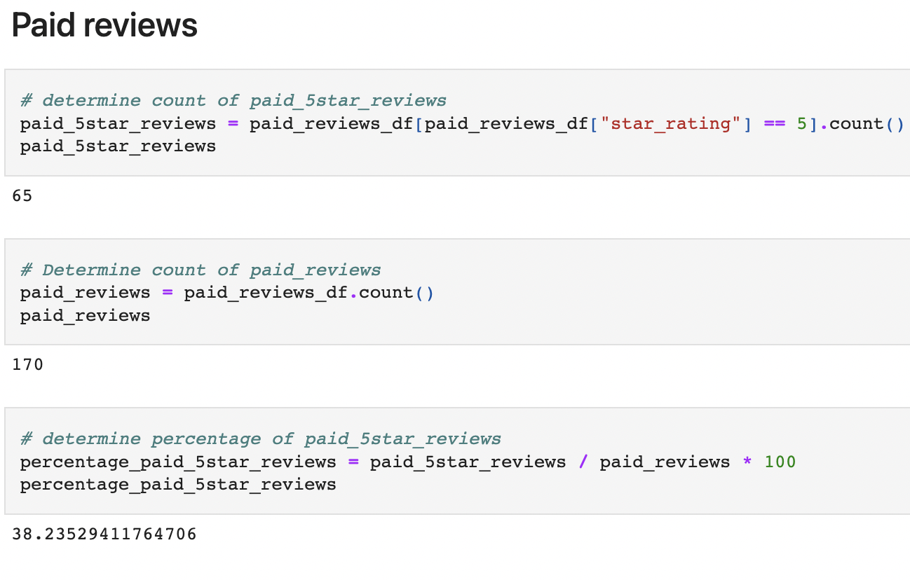
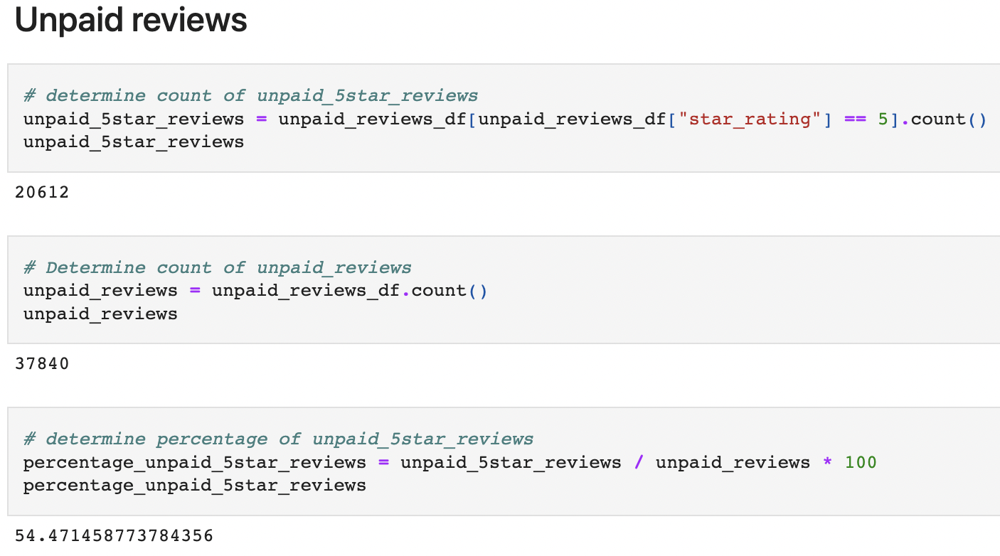

# Amazon_Vine_Analysis

## Overview of Vine Analysis 

The purpose of this analysis is to assess the amount of helpful votes that are equal to or more than 50% on a review, whether there are 20 or more votes on a review, vine reviews (or paid reviews) there are in comparison to nonpaid reviews, the total amount of paid reviews that are 5 stars, and the percentage of 5 star reviews for paid and nonpaid reviews.

## Results

* The total of vine reviews was 170
* The total of non-vine reviews was 37,840
* The amount of 5-star vine reviews was 65
* The amount of 5-star non-vine reviews was 20,612
* The percentage of 5-star vine reviews was 38.24%
* The percentage of 5-star non-vine reviews was 54.47%

## Summary

While the percentage of 5-star reviews for vine ratings does not exceed 50%, given that the total amount of reviews to draw from is only 170 and 65 of those are 5-star, it does seem statistically unlikely that there is not some sort of positivity bias within the program. Such a small dataset with as many 5-star reviews compared to the much larger non-vine 5-star reviews being close in percentage (38.24% vs. 54.47%) would indicate such a bias.

Another analysis that could be performed on the dataset would be to compare the review_id and verified_purchase as these might also indicate some bias in continuous 5-star reviews.
